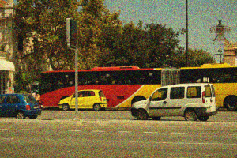
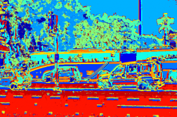
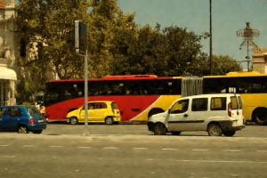
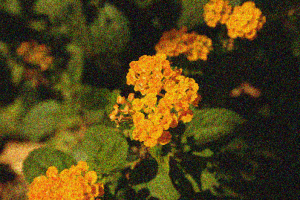
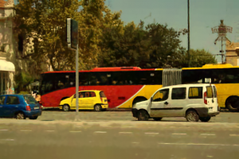
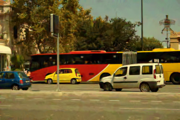
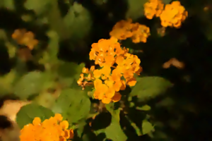

An enhanced version of the paper [High-Dimensional Mixture Models For Unsupervised Image Denoising (HDMI) is online](https://houdard.wp.imt.fr/hdmi/). This version include new experiments with color images!

<table width="1200" cellspacing="»0″" cellpadding="»0″"><tbody><tr><td style="text-align: center"><em><strong>Noisy image</strong></em></td><td style="text-align: center"><em><strong>Clustering from HDMI</strong></em></td><td style="text-align: center"><em><strong>Denoised with HDMI</strong></em></td></tr></tbody></table>

More results are presented hereafter:

<table cellspacing="»0″" cellpadding="»0″"><tbody><tr><td></td><td style="text-align: center"><strong><em>Flower</em></strong></td><td style="text-align: center"><em><strong>Traffic</strong></em></td></tr><tr><td style="text-align: center"><em><strong>Noisy</strong></em></td><td></td><td></td></tr><tr><td style="text-align: center"><em><strong>NL-bayes</strong></em></td><td></td><td></td></tr><tr><td style="text-align: center"><em><strong>BM3D</strong></em></td><td></td><td></td></tr><tr><td style="text-align: center"><em><strong>S-PLE</strong></em></td><td></td><td></td></tr><tr><td style="text-align: center"><em><strong>HDMI</strong></em></td><td></td><td></td></tr></tbody></table>
