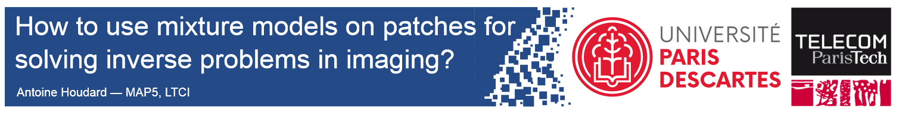

I'm presenting the following poster at SIAM IS18 (June 5-8, 2018):

#### [How to use mixture models on patches for solving image inverse problems](https://houdard.wp.imt.fr/files/2018/06/poster_siam_Antoine_Houdard.pdf)

More information about the HDMI method for image denoising [here](https://houdard.wp.imt.fr/hdmi/).

I received the [3rd best poster award](https://www.siam-is18.dm.unibo.it/) for this poster!
