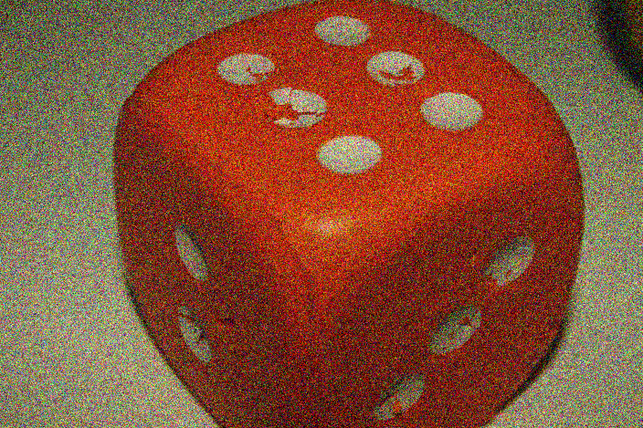
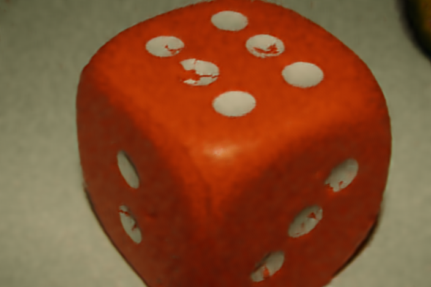
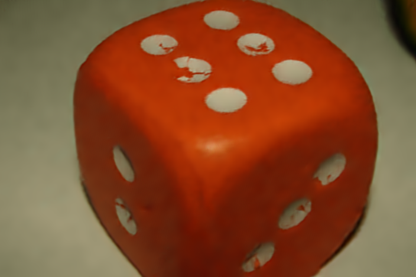
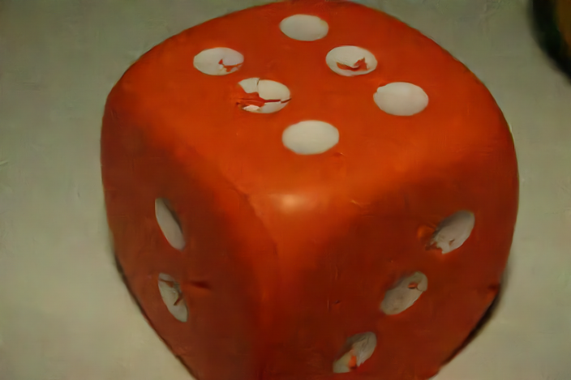

##### [Statistical Modeling of the Patches DC Component for Low-Frequency Noise Reduction](https://hal.archives-ouvertes.fr/hal-02024205) \[[pdf](https://houdard.wp.imt.fr/files/2019/02/2019_modeling_HAL-1.pdf)\]

**Abstract:** In this work, we consider an additive white Gaussian noise (AWGN) model on the image patches in the context of patch-based image denoising. From this, we propose a derivation of the induced models on the centered patch of noise and on the DC component of the noise. These models allow us to treat separately the two component. We provides experiments with the [HDMI method](https://houdard.wp.imt.fr/recherche/hdmi/) \[[pdf](https://hal.archives-ouvertes.fr/hal-01544249v3/document)\] that lead to denoising quality improvements, particularly for residual low frequency noise.

**More...** first color experiments came up! For images with many constant areas and few textured parts the results are extremely positive, for instance, the improvement for the image _dice_ with a noise of standard deviation 50/255, is up to 0.25dB. The final result is even better than the recent deep learning method FFDNet.

<table style="height: 252px" width="566" cellspacing="»0″" cellpadding="»0″"><tbody><tr><td></td><td>Image</td><td>&nbsp;PSNR (dB)</td></tr><tr><td><em><strong>Noisy</strong></em></td><td></td><td>-</td></tr><tr><td><em><strong>HDMI [<a href="https://hal.archives-ouvertes.fr/hal-01544249v3/document">pdf</a>]</strong></em></td><td></td><td>36.47 dB</td></tr><tr><td><em><strong>HDMI + DC component</strong></em></td><td></td><td>36.90 dB</td></tr><tr><td><em><strong>FFDNet [<a href="http://www.ipol.im/pub/art/2019/231/">demo</a>]</strong></em></td><td></td><td>36.72 dB</td></tr></tbody></table>
