Some new application of our recent work **Wasserstein Generative Models for Patch-based Texture Synthesis** \[[arXiv](https://arxiv.org/abs/2007.03408)\] \[[HAL](https://hal.archives-ouvertes.fr/hal-02824076v2/document)\] that proposed a loss with semi-dual formulation of OT.

- **Style transfert** using **semi-dual formulation** for minimizing the **OT distance between VGG-19 features**:

[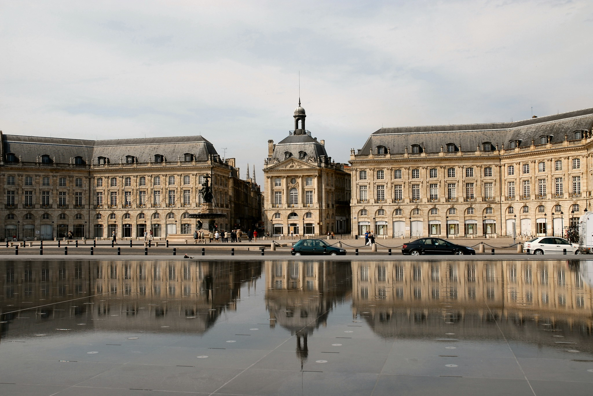](https://houdard.wp.imt.fr/files/2019/04/Miroir_deau_place_de_la_Bourse.jpg)[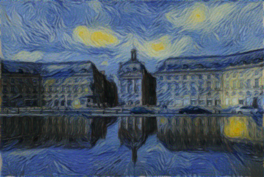](https://houdard.wp.imt.fr/files/2020/08/miroir_VG.png) [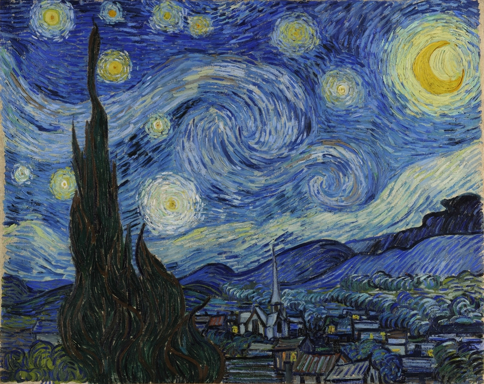](https://houdard.wp.imt.fr/files/2020/08/table_cat_html_html_2ae5e699.jpg) [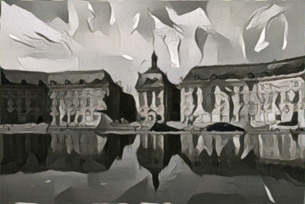](https://houdard.wp.imt.fr/files/2020/08/miroir_Guernica.png)     [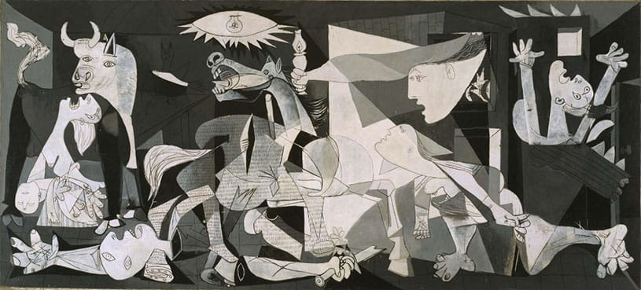](https://houdard.wp.imt.fr/files/2020/08/Guernica-.jpg)

[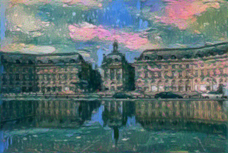](https://houdard.wp.imt.fr/files/2020/08/miroir_monet.png)     [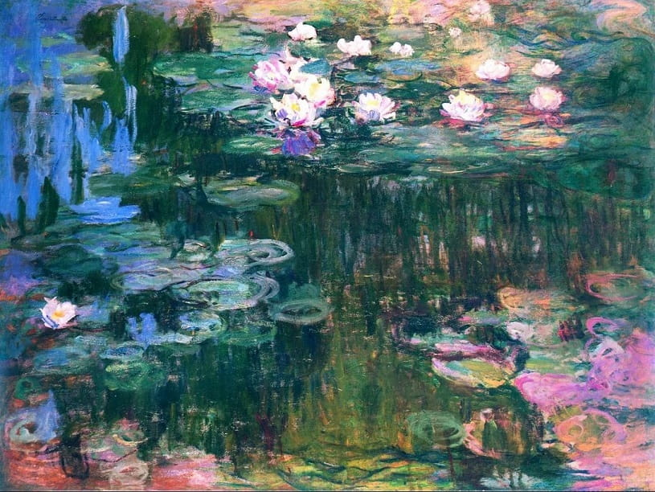](https://houdard.wp.imt.fr/files/2020/08/lilies.jpg)

[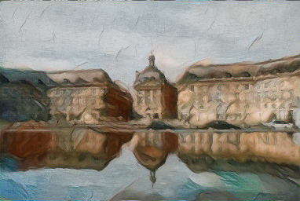](https://houdard.wp.imt.fr/files/2020/08/miroir_adam.png)    

[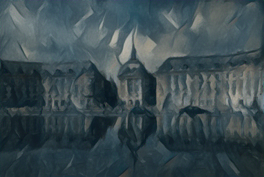](https://houdard.wp.imt.fr/files/2020/08/miroir_picasso.png)  

- **Textures barycenters** using our texture generation algorithm (Alg.1 from [this work](https://houdard.wp.imt.fr/2020/06/22/wasserstein-generative-models-for-patch-based-texture-synthesis-preprint/)).

The key idea is to **generate a new texture** such that its **patch distributions** at various scales are **Wasserstein barycenters** of the patch distribution of the two inputs:

 [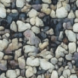](https://houdard.wp.imt.fr/files/2020/08/patch_barycenter_S17_m_128-Rstone14_128.png) [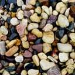](https://houdard.wp.imt.fr/files/2020/08/Rstone14_128-1.png) input 1                       W-barycenter                    input 2

 [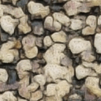](https://houdard.wp.imt.fr/files/2020/08/patch_barycenter_rock11_128-Rstone14_128.png)  input 1                       W-barycenter                    input 2
