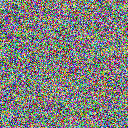
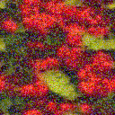

With the publication in the SSVM 2021 proceeding of our paper [Wasserstein Generative Models for Patch-based Texture Synthesis](https://link.springer.com/chapter/10.1007/978-3-030-75549-2_22) we just released the corresponding Python code available on github !

## [github.com/ahoudard/wgenpatex](http://github.com/ahoudard/wgenpatex)

Example on my local laptop (core i5 CPU) :

`python run_optim_synthesis.py radishes.png --save  
cpu  
iteration 0 - elapsed 2s - loss = 3.3926462531089783  
iteration 50 - elapsed 131s - loss = 0.5145381316542625  
iteration 100 - elapsed 260s - loss = 0.23772023245692253  
iteration 150 - elapsed 390s - loss = 0.20723320543766022  
iteration 200 - elapsed 522s - loss = 0.20013415440917015  
iteration 250 - elapsed 652s - loss = 0.19069230556488037  
iteration 300 - elapsed 781s - loss = 0.18442947790026665  
iteration 350 - elapsed 912s - loss = 0.18047476187348366  
iteration 400 - elapsed 1042s - loss = 0.17874254286289215  
iteration 450 - elapsed 1162s - loss = 0.17782559990882874  
DONE - total time is 1292s`

- 
    
    iteration 0
    
- 
    
    iteration 50
    
- 
    
    iteration 100
    
- 
    
    iteration 150
    
- 
    
    iteration 200
    
- 
    
    iteration 250
    
- 
    
    iteration 300
    
- 
    
    iteration 350
    
- 
    
    iteration 400
    
- 
    
    iteration 450
    
- 
    
    synthesized image
    
- 
    
    original image
