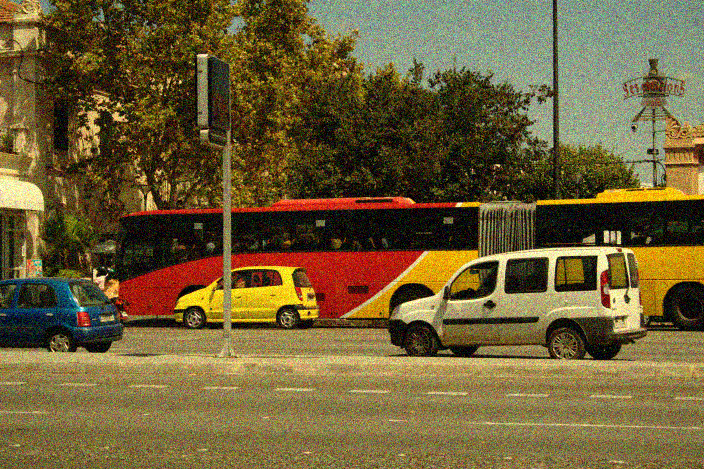

I just released a pytorch implementation of the [HDMI denoising method](https://houdard.wp.imt.fr/2018/02/23/new-version-of-hdmi/) that can be used on GPU: [github.com/ahoudard/HDMI](https://github.com/ahoudard/HDMI)

This version allows to run the EM algorithm and the denoising in about half a minute!

```
python run_HDMI_denoising.py alley.png --stdv 0.1 --n_iter 40 --verbose --gpu
selected device: cuda
run EM algorithm...
denoise patches...
total runtime: 34s
PSNR: 29.8940dB
```

- 
    
    clean image
    
- 
    
    noisy image
    
- 
    
    denoised image
